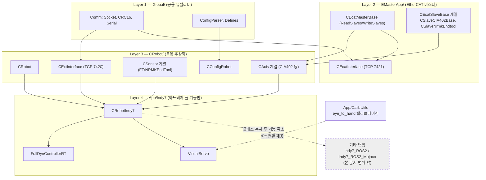
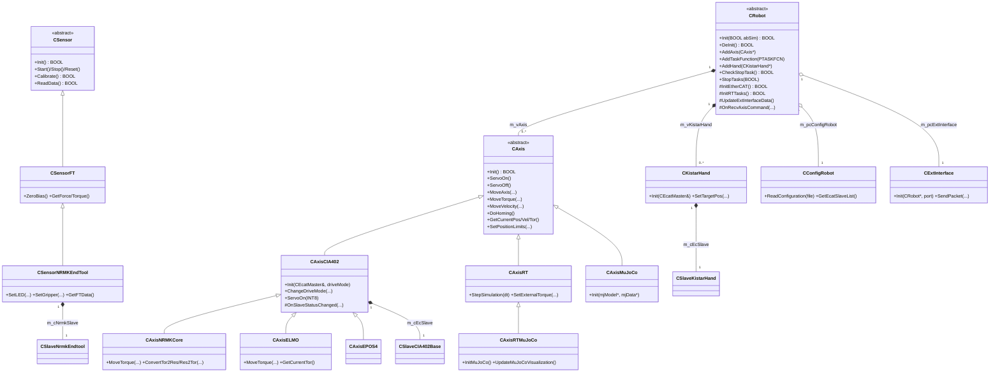
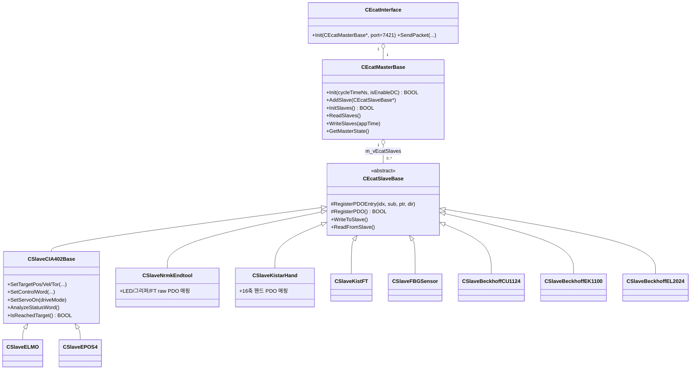
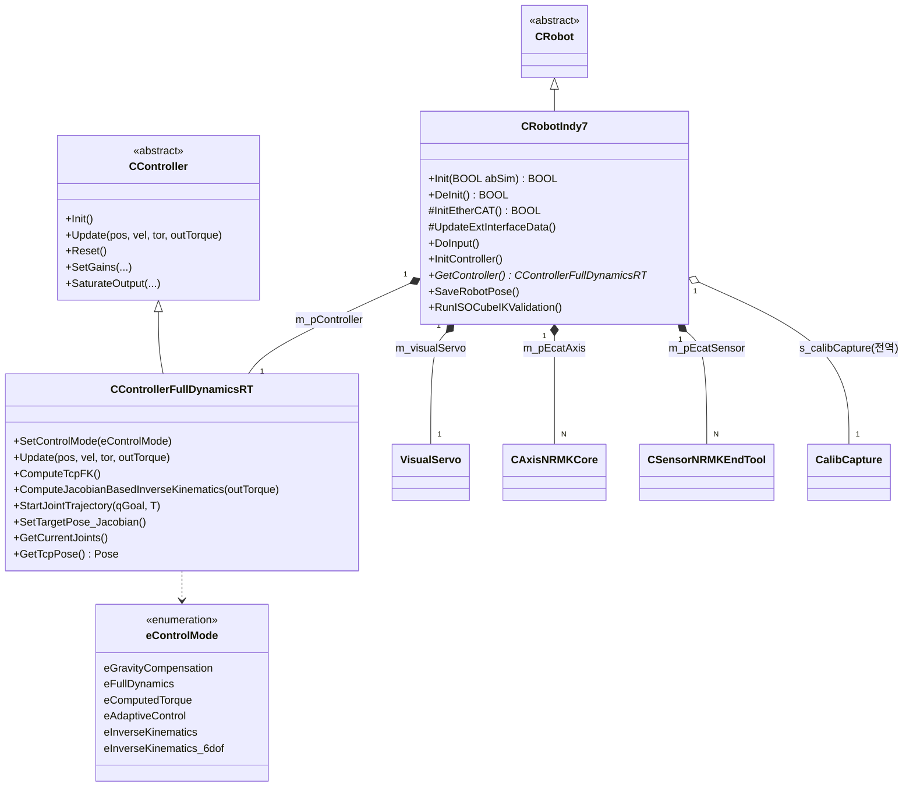
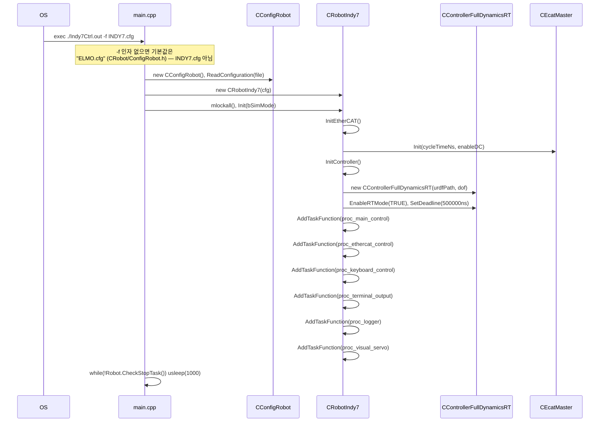
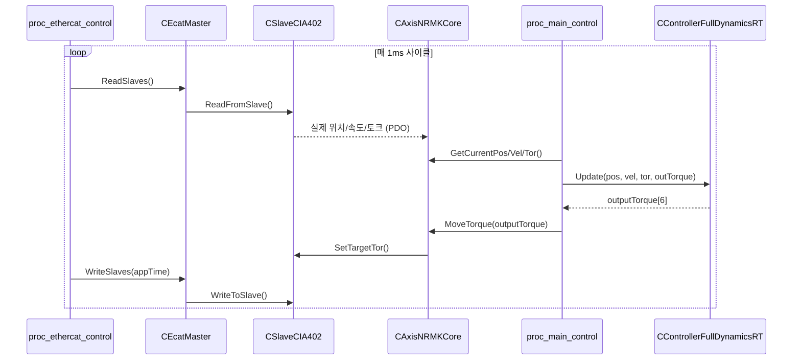
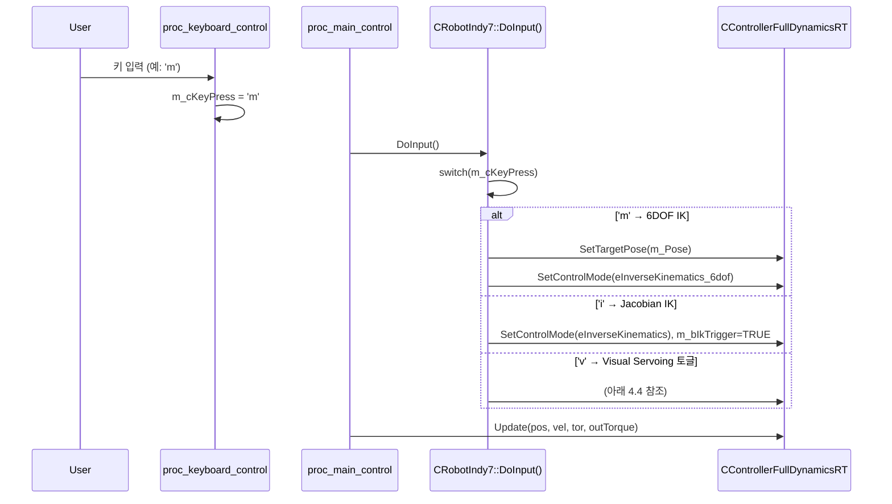

# RAON-RT

Neuromeka Indy7 (6-DOF) 로봇을 PREEMPT_RT Linux 상에서 실시간 제어하기 위한 프레임워크 + 애플리케이션 모노레포.
이 문서는 실제 소스 코드를 근거로 작성된 아키텍처/동작 문서이며, `README.md.txt`(초기 비전 문서)와 별개로 **현재 코드의 실제 구조**를 반영한다.

**범위**: 이 문서는 하드웨어 풀 기능판인 `App/Indy7`을 기준으로 서술한다. `App/Indy7_ROS2`(ROS2 topic/service를 얹은 경량판)와 `App/Indy7_ROS2_Mujoco`(그 위에 Mujoco 시뮬레이션 백엔드를 더한 판)는 `CRobotIndy7`/`CController` 설계를 복사해 기능을 덜어낸 별도 변형으로만 존재를 언급하고, 상세 구조는 다루지 않는다.

> 마지막 코드 조사 기준: 2026-07-27. HEAD 커밋은 `d390436` (2026-06-18)이며, 이후 상당량의 커밋되지 않은 변경(FullDynControllerRT, Indy7Ctrl, VisualServo, CalibUtils 재구성 등)이 워킹트리에 존재한다. `git status`의 "up to date with origin/main"은 이 워킹트리 변경을 반영하지 않으므로 주의.

---

## 1. 저장소 구조

```
RAON-RT/
├── Global/                    # 최하위 공용 유틸리티 (특정 로봇/드라이버에 종속되지 않음)
│   ├── Defines.h              # BOOL/TSTRING/BYTE 등 전역 타입
│   ├── ConfigParser.h/.cpp    # INI(.cfg) 파서 (GetPrivateProfileString/Int)
│   └── Comm/
│       ├── Socket.h/.cpp      # CSocket, CTcpClient, CTcpServer
│       ├── CRC16.h/.cpp       # CRC16, CRC16_ARC
│       ├── Serial.h/.cpp      # CSerialComm (RS232/485)
│       └── ROS2*.h/.cpp       # CROS2Node/Executor/IndyIface/AxisInfo/PointCloud/PrismIface
│
├── EMasterApp/                # EtherCAT 마스터 프레임워크 (IgH EtherCAT, ecrt.h 기반)
│   ├── Device/
│   │   ├── EcatMasterBase.h/.cpp   # CEcatMasterBase (= CEcatMaster)
│   │   ├── EcatSlaveBase.h/.cpp    # CEcatSlaveBase (PDO 등록/읽기/쓰기 공통 베이스)
│   │   ├── SlaveCIA402Base.h/.cpp  # CSlaveCIA402Base (= CSlaveCIA402) — CIA402 상태기계
│   │   ├── SlaveELMO.h / SlaveEPOS4.h
│   │   ├── SlaveNRMKEndTool.h/.cpp, SlaveKistarHand.h/.cpp
│   │   ├── SlaveKistFT.h, SlaveFBGSensor.h
│   │   └── SlaveBeckhoffCU1124.h, SlaveBeckhoffEK1100.h, SlaveBeckhoffEL2024.h
│   └── Interface/
│       └── EcatInterface.h/.cpp    # CEcatInterface — EtherCAT 상태 조회용 TCP 서버 (port 7421)
│
├── CRobot/                    # 로봇 추상화 계층 (EMasterApp을 감싸는 축/센서/로봇 베이스)
│   ├── Robot.h/.cpp            # CRobot — 로봇 상태기계/오케스트레이터 베이스
│   ├── Axis.h(.cpp)            # CAxis — 축(관절) 추상 베이스 (~70개 가상 함수)
│   ├── AxisCIA402.h/.cpp       # CAxisCIA402 : CAxis  (+ CSlaveCIA402 합성)
│   ├── AxisNRMKCore.h/.cpp     # CAxisNRMKCore : CAxisCIA402  ← Indy7이 실제 사용
│   ├── AxisELMO.h/.cpp, AxisEPOS4.h
│   ├── AxisRT.h/.cpp           # CAxisRT : CAxis — HW 없는 RT 시뮬레이션 축 (PID+동역학)
│   ├── AxisRTMuJoCo.h/.cpp     # CAxisRTMuJoCo : CAxisRT (+ CRobotRTMuJoCo)
│   ├── AxisMuJoCo.h/.cpp       # CAxisMuJoCo : CAxis — Mujoco 관절 직결
│   ├── MuJoCoVisualization.h/.cpp
│   ├── Sensor.h                # CSensor — 센서 추상 베이스
│   ├── SensorFT.h/.cpp         # CSensorFT : CSensor
│   ├── SensorNRMKEndTool.h/.cpp# CSensorNRMKEndTool : CSensorFT  ← Indy7이 실제 사용
│   ├── KistarHand.h/.cpp       # CKistarHand — 그리퍼 핸드 (+ CSlaveKistarHand 합성)
│   ├── ConfigRobot.h/.cpp      # CConfigRobot — .cfg → 구조체 파싱
│   └── ExtInterface.h/.cpp     # CExtInterface — UI용 TCP 서버 (port 7420)
│
├── include/EMasterApp/, lib/EMasterApp/   # EMasterApp 헤더/라이브러리 스테이징 트리 (빌드 산출물, 고유 소스 없음)
│
├── App/
│   ├── Indy7/                  # ★ 메인 하드웨어 애플리케이션 (jieun 작업 영역)
│   │   ├── main.cpp             # 엔트리포인트
│   │   ├── Indy7Ctrl.h/.cpp     # CRobotIndy7 : CRobot — 앱의 중심 클래스
│   │   ├── Controller.h/.cpp    # CController — 앱 로컬 컨트롤러 베이스
│   │   ├── FullDynControllerRT.h/.cpp  # CControllerFullDynamicsRT : CController
│   │   ├── VisualServo.h/.cpp   # VisualServo — AprilTag 기반 시각 서보잉 (WIP)
│   │   ├── CalibCapture.h/.cpp  # 캘리브레이션 포즈 캡처 헬퍼
│   │   ├── DataRecorder.h       # ST_LOG_ENTRY + lock-free RingBuffer
│   │   ├── indy7_v2.urdf, INDY7.cfg (root:600)
│   │   ├── indy7_ui.py          # 캘리브레이션 캡처 포함 GUI
│   │   └── 산출물: rt_log_results/, iso_csv/, calib_data/
│   │
│   ├── Indy7_ROS2/              # (별도 변형) ROS2 topic/service를 얹은 경량판 — 본 문서 범위 밖
│   ├── Indy7_ROS2_Mujoco/       # (별도 변형) 위 + Mujoco 시뮬레이션 백엔드 — 본 문서 범위 밖
│   │
│   └── CalibUtils/              # Hand-eye 캘리브레이션 도구
│       ├── save_camera_params.cpp     # RealSense 내부 파라미터 → camera.xml
│       ├── visp-compute-apriltag-poses# 이미지+camera.xml → pose_cPo_N.yaml
│       ├── eye_to_hand/               # eye_to_hand_calib.py → rPc.yaml (VisualServo가 실사용)
│       └── eye_in_hand/               # eMc.txt/yaml (결과만 존재, 현재 미사용 레거시)
│
├── Config/, scripts/, vs_test/
└── Makefile
```

---

## 2. 계층형 아키텍처



**핵심 원칙**: `EMasterApp`은 EtherCAT PDO 송수신만 담당하는 하드웨어 인접 계층이고, `CRobot`은 그 위에서 "축·센서·로봇"이라는 도메인 개념으로 감싼 재사용 가능한 프레임워크다. `App/Indy7`은 이 둘을 조합한 뒤 `CRobotIndy7`이라는 하나의 관리 객체 아래 `FullDynControllerRT`(제어)와 `VisualServo`(비전)를 매달아 Indy7 고유 로직을 완성한다. `Indy7_ROS2`/`Indy7_ROS2_Mujoco`는 이 `CRobotIndy7` 설계를 그대로 복사한 뒤 IK·궤적·VisualServo 기능을 덜어내고 ROS2 인터페이스(및 Mujoco 백엔드)를 붙인 별도 변형으로, 클래스를 상속·공유하는 관계가 아니라 소스 복사 관계다.

---

## 3. 클래스 다이어그램

### 3.0 CRobot 상세 — 관리 객체와 동작 흐름

`CRobot`(`CRobot/Robot.h:42`, `Robot.cpp`)의 핵심은 **자신이 직접 소유하는 다섯 종류의 관리 객체로 로봇 하나를 표현한다**는 점이다: EtherCAT 마스터(`m_pcEcatMaster`), 설정 파서(`m_pcConfigRobot`), UI 서버(`m_pcExtInterface`), 축 목록(`m_vAxis`), RT 태스크 목록(`m_vTask`/`m_vTaskFunctions`). 이 다섯 개가 `CRobot`이 다루는 것의 전부이고, EtherCAT 프로토콜의 세부 내용이나 로봇의 실제 관절 개수 같은 구체적인 정보는 전혀 모른다. 대신 하위 계층(`CEcatMaster`)과 상위 자식 앱 클래스(`CRobotIndy7`) 사이에서, "이런 객체들이 있어야 한다"는 뼈대만 쥔 채 실제 내용을 양쪽에 위임하는 **템플릿 메서드 패턴의 오케스트레이터**로 동작한다.

이 위임 구조는 `Init(BOOL abSim)`(`Robot.cpp:27`)의 실행 순서에 그대로 드러난다. `InitExtInterface()`가 먼저 `m_pcExtInterface`를 채우고(실패해도 앱은 계속 진행), 이어서 `InitEtherCAT()`이 `m_pcEcatMaster`와 `m_vAxis`를 채우는데, 이 함수의 기본 구현은 `{ return FALSE; }`뿐이라 자식 클래스가 반드시 오버라이드해야 한다 — `CRobot` 자신은 아무 축도 만들지 않고 "언젠가 자식이 채워줄 것"이라는 계약만 정의한다. 마지막으로 `InitRTTasks()`(`Robot.cpp:118`)가 `.cfg`의 태스크 개수와 자식이 생성자에서 `AddTaskFunction()`으로 미리 등록해둔 함수 개수를 대조하고, 일치할 때만 `m_vTask`에 실제 RT 스레드를 채워 넣는다. 스레드 개수와 주기는 `.cfg`가 결정하고, 그 스레드가 실제로 하는 일은 자식 클래스가 결정하는 역할 분담이 여기서 성립한다.

`DeInit()`(`Robot.cpp:75`)은 이 흐름을 거꾸로 되짚는다. `StopTasks()`로 `m_vTask`를 정지시키고, 2초 대기로 정리 시간을 확보한 뒤, `m_pcEcatMaster->DeInit()`으로 EtherCAT을 끊고, 마지막으로 `m_vAxis`를 순회하며 각 축의 최종 위치를 `.cfg`에 저장한다(`WriteLastPosition`, 재기동 시 위치 추정용). 하드웨어를 안전하게 종료하는 순서 자체가 `CRobot`이 강제하는 계약이다. 이 세 함수 외에도 `UpdateExtInterfaceData()`(기본은 EtherCAT 메타데이터만 UI로 전송, 자식이 확장), `IsAgingTest()`/`DoAgingTest()`(내구성 테스트, 기본은 빈 구현), `OnRecvAxisCommand(...)`(UI발 축 명령 콜백, 현재는 값을 받고 버리는 미완성 상태)까지 총 6개의 protected virtual 훅이 있으며, 전부 자식 클래스가 선택적으로 채워 넣는 지점이다.

로봇의 현재 상태는 `eRobotStateMach`(`Robot.h:30`) 하나의 열거형(`eRobotInit`/`eRobotIdle`/`eRobotOperation`/`eRobotStopped`/`eRobotEmg`/`eRobotError`/`eRobotDeInit`/`eRobotUnknown`)으로 표현되고 `GetState()`/`SetState()`로 오간다. 이 상태를 포함한 `private` 멤버는 원래 캡슐화되어야 하지만, `friend class CExtInterface`(`Robot.h:110`) 선언으로 UI 인터페이스만은 예외적으로 직접 접근이 허용된다 — 로봇 상태를 UI에 실시간으로 보여줘야 한다는 요구가 캡슐화 원칙보다 우선한 지점이다.

`CRobot`을 직접 상속하는 클래스는 저장소 전체에서 `CRobotIndy7` 하나뿐이다. 이 문서가 다루는 `App/Indy7`판을 포함해 총 세 벌이 존재하지만(3.1절 참고), 서로 상속 관계가 아니라 소스 복사 관계다.

### 3.1 CRobot 계층 — 축/센서/로봇 베이스



#### CRobotIndy7 — CRobot의 유일한 하위 클래스

`CAxis`는 `CAxisCIA402`/`CAxisRT`/`CAxisMuJoCo` 등 실제로 다른 하드웨어를 대표하는 여러 하위 클래스를 갖지만, `CRobot`을 직접 상속하는 클래스는 저장소 전체에서 **`CRobotIndy7` 하나뿐**이다. `App/Indy7`판은 `InitEtherCAT()`에서 실제 `CAxisNRMKCore[]`/`CSensorNRMKEndTool[]`를 생성해 EtherCAT에 등록하고, `UpdateExtInterfaceData()`에 TCP pose·제어모드·VisualServo 상태까지 실어 UI로 보내도록 확장하며, `DataRecorder`(로깅), `CalibCapture`(캘리브레이션 포즈 캡처), `VisualServo`(시각 서보잉), Jacobian/RBDL 6DOF IK와 궤적 생성까지 자체적으로 매달아 실물 로봇을 EtherCAT으로 구동하는 연구용 풀 기능판을 완성한다.

같은 `CRobotIndy7` 설계가 소스 파일 복사 형태로 `App/Indy7_ROS2`(ROS2 topic/service를 얹은 대신 IK·궤적·VisualServo는 제거한 게이트웨이판)와 `App/Indy7_ROS2_Mujoco`(그 위에 Mujoco 시뮬레이션 백엔드를 더한 판)로도 존재하지만, 상속이 아니라 복사 관계이고 본 문서는 다루지 않는다. 다만 이 구조 때문에 `App/Indy7`에서 추가한 기능이 다른 두 판에 자동으로 반영되지 않는다는 점은 유지보수 관점에서 기억해둘 필요가 있다 — `Controller.cpp/.h`는 세 판 모두 바이트 단위로 동일하지만 `FullDynControllerRT`/`Indy7Ctrl`은 이미 갈라져 있다.

### 3.2 EMasterApp 계층 — EtherCAT 슬레이브



PDO 오프셋(참고): `0x6040` 제어워드, `0x6041` 상태워드, `0x6060`/`0x6061` 구동모드, `0x607A`/`0x60FF`/`0x6071` 목표 위치/속도/토크, `0x6064`/`0x606C`/`0x6077` 실제 위치/속도/토크.

### 3.3 App/Indy7 애플리케이션 계층



---

## 4. 시퀀스 다이어그램

### 4.1 애플리케이션 기동



### 4.2 RT 제어 루프 (1kHz) — EtherCAT PDO 교환



### 4.3 제어 모드 전환 (키보드 입력)



같은 모드 전환 집합은 `CExtInterface`(TCP 7420)를 통해 UI에서도 동일하게 트리거된다 (`SUBCMD_CTRL_*` 바이트 커맨드).

### 4.4 시각 서보잉 (Visual Servoing) — 개요

`v` 키로 `VisualServo`(`m_visualServo`)를 켜면 `proc_visual_servo` 태스크가 비-RT 우선순위(`SCHED_OTHER`)로 카메라 인식을 돌리고, 그 결과 목표 pose를 `proc_main_control`이 1kHz 주기로 읽어가 `CControllerFullDynamicsRT`에 넘기는 식으로 동작한다. 카메라/캘리브레이션 관련 내부 로직(AprilTag 인식, 필터링 등)은 `App/CalibUtils`의 캘리브레이션 결과물(`eye_to_hand/rPc.yaml`)에 의존하는 애플리케이션 기능 상세라 이 문서에서는 다루지 않는다 (WIP 상태 — 커밋 메시지 기준 "calibration error remains").

---

## 5. 다른 변형에 대한 참고

`App/Indy7_ROS2`와 `App/Indy7_ROS2_Mujoco`는 이 문서가 다루는 `App/Indy7`의 `CRobotIndy7`/`CController` 설계를 그대로 복사한 뒤, IK·궤적·VisualServo 기능은 덜어내고 ROS2 topic/service(`indy_state`, `get/set_gains`, `set_pos`, `set_all_pos`, `get/set_control_mode`)를 얹은 경량 게이트웨이판이다. `Indy7_ROS2_Mujoco`는 여기에 `-DMUJOCO_ENABLED` 빌드 플래그로 Mujoco 물리 시뮬레이션 백엔드(`CAxisRTMuJoCo`)까지 더해, 하드웨어 없이 ROS2 제어 로직을 먼저 검증할 때 쓴다. 두 변형 모두 상세 구조는 본 문서의 범위 밖이다.

---

## 6. 데이터 흐름 / 산출물

| 경로 | 생성 주체 | 내용 |
|---|---|---|
| `App/Indy7/rt_log_results/DataLog_*.csv` | `proc_logger` (`l` 키로 5초 트리거) | `ST_LOG_ENTRY`: q, q_ref, qd, tau, TCP pose, goal pose, ctrl_mode |
| `App/Indy7/iso_csv/hardware/` | ISO 9283 HW 테스트 (`p` 키) | 5개 큐브 포인트 × 10사이클 AP/RP 결과 |
| `App/Indy7/iso_csv/virtual/` | `RunISOCubeIKValidation` (`z` 키) | 소프트웨어 IK 검증 데이터 |
| `App/Indy7/calib_data/robot_poses.csv` | `SaveRobotPose()` (`s` 키) | 캘리브레이션용 저장 포즈 |
| `App/CalibUtils/eye_to_hand/rPc.yaml` | `eye_to_hand_calib.py` | base→camera 변환 — **VisualServo가 실제로 로드** |
| `App/CalibUtils/eye_in_hand/eMc.*` | (레거시) | end-effector→camera 변환 — 현재 어떤 코드도 로드하지 않음 |
| ~~`App/Indy7/rt_ik_error_log/`~~ | (제거됨) | IK 정확도 CSV 로거 코드가 최근 삭제되며 디렉터리도 함께 사라짐 |

---

## 7. 코드 조사에서 확인된 주의사항

- **`main.cpp` 기본 설정 파일**: `DEFAULT_CONFIGURATION_FULLPATH`는 `CRobot/ConfigRobot.h`에 `"ELMO.cfg"`로 정의되어 있다. `INDY7.cfg`를 쓰려면 반드시 `-f INDY7.cfg`를 명시해야 하며, 자동으로 로드되지 않는다.
- **`eControlMode`는 `CRobotIndy7`가 아니라 `CControllerFullDynamicsRT`에 정의**되어 있다 (`FullDynControllerRT.h`).
- **`Controller.cpp`는 git status상 "modified"로 보이지만 실제 diff는 없다** — 재빌드로 인한 touch로 추정되며, 오늘 실질적으로 바뀐 파일은 `FullDynControllerRT.cpp/.h`, `Indy7Ctrl.cpp/.h`, `VisualServo.cpp/.h`이다.
- **`App/CalibUtils`의 파일 다수는 삭제가 아니라 재구성**이다: 루트에 흩어져 있던 파일들이 `eye_to_hand/`(rPc, camera.xml 등)와 `eye_in_hand/`(eMc)로 이동했다. 단, `pose_cPo_*.yaml`/`image*.png`는 캡처마다 재생성되는 임시 산출물로 실제로 사라진 게 맞다.
- **`rt_ik_error_log/`는 코드에서 의도적으로 제거**되었다 (`FullDynControllerRT.cpp::PrintTcpVerificationResult()`의 CSV 로깅 블록 삭제).
- **`App/Indy7_ROS2_Mujoco`의 `INDY7.cfg`에 `MOJUCO_XML_PATH`가 명시적으로 설정되어 있지 않다** (기본값 `"TEST.xml"`) — 시뮬레이션 실행 전 확인 필요.
- **HEAD(`d390436`, 2026-06-18)와 현재 워킹트리 사이에 한 달 이상의 커밋 안 된 변경이 존재**한다. `git status`의 "up to date with origin/main" 문구에 속지 말 것.

---

## 8. Q&A 기록

작업하며 나온 질문과 답변을 이 섹션에 계속 누적한다. 새로운 질문이 생기면 아래 형식으로 추가한다.

> **Q.** 질문 내용
> **A.** 핵심 답변 (필요시 위 다이어그램/섹션 링크)

### 2026-07-27

> **Q.** RAON-RT 구조를 어디까지, 어떤 다이어그램으로 문서화할까?
> **A.** 전체 저장소(Global/EMasterApp/CRobot/App 전체)를 대상으로, 계층형 아키텍처 다이어그램 1개 + 클래스 다이어그램(계층별 3개) + 시퀀스 다이어그램(기동/RT루프/모드전환/VisualServo)을 Mermaid로 이 README에 작성하기로 함. → 위 2~4절 참조.

> **Q.** 주요 클래스 `CRobot` 등에 대한 설명은?
> **A.** `CRobot`은 EtherCAT/RT태스크 초기화를 `.cfg`와 자식 클래스에 위임하는 템플릿 메서드 패턴의 오케스트레이터. `Init()`/`InitRTTasks()`/`DeInit()` 흐름과 `friend class CExtInterface` 캡슐화 완화가 핵심. → 3.0절 참조.

> **Q.** `CRobot`의 하위 클래스들의 의미와 역할은?
> **A.** 실제로는 "여러 로봇 타입"이 아니라 `CRobotIndy7` 하나의 개념이 `App/Indy7`(하드웨어 풀 기능판) / `App/Indy7_ROS2`(ROS2 노출판) / `App/Indy7_ROS2_Mujoco`(ROS2+시뮬레이션 겸용판) 세 디렉터리에 소스 복사로 나뉜 것. `CRobotRTMuJoCo`는 이름과 달리 `CRobot`의 하위 클래스가 아님. → 3.1절 "CRobot의 하위 클래스" 표 참조.

---

*이 문서는 소스 코드 정적 분석을 기반으로 작성되었다. 코드가 변경되면 특히 5~7절(비교표, 데이터 흐름, 주의사항)은 재검증이 필요하다.*
